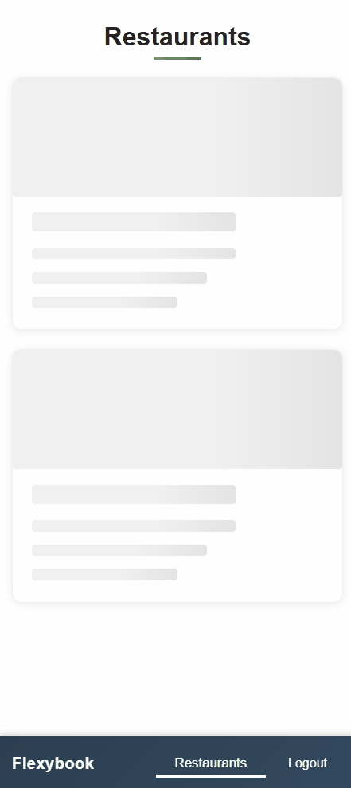
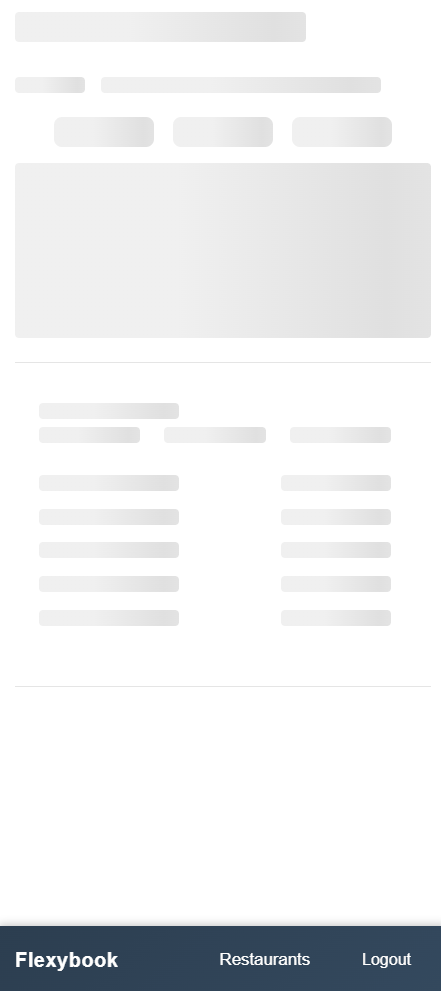

## 📋 Assignment Overview & Feature Summary

This project was developed as part of a .NET Developer job application assignment for FlexyBox ApS. The goal was to implement a Blazor application based on a provided Figma design ([Figma link](https://www.figma.com/design/BPYVMBj1ZgYK2U4gp218HU/Flexybook---DevTest?node-id=1-10282&t=Lod4mSn7BonpPL63-4)), without using component libraries or CSS frameworks, to demonstrate creativity and problem-solving in UI implementation.

### Implemented Features (per requirements)

- **Custom Blazor components**: All UI elements were built from scratch, matching the Figma design as closely as possible without component libraries or CSS frameworks.
- **Restaurant listing and details**: Browse all restaurants, view details, contact info, and opening hours for multiple service types.
- **Favorites system**: Mark/unmark restaurants as favorites, persisted per user.
- **Responsive design**: Fully responsive layout for both desktop and mobile, closely following the Figma mobile and desktop views.
- **Tab navigation**: Switch between different opening hour types (Restaurant, Takeaway, Buffet, Special Events) with swipeable tabs.
- **Image gallery**: Horizontal scrollable image gallery with mouse wheel and touch support.
- **Authentication**: Login/logout flow with seeded user, using ASP.NET Core Identity (no credentials required for demo login).
- **Skeleton loaders**: Smooth loading states for data fetches, matching the Figma design.
- **Error handling**: Custom 404 page for invalid routes.
- **In-memory database**: Entity Framework Core with demo data seeding for rapid prototyping.
- **Clean architecture**: Domain, Infrastructure, ApplicationService, and UI layers for maintainability and testability.

### Enhancements Beyond Requirements

- **Automated tests**: Added unit tests for helpers and services to ensure code quality and reliability.
- **JWT authentication**: Implemented JWT token handling to demonstrate secure authentication patterns.
- **Smart hour grouping**: Automatically groups days with identical opening hours for a cleaner UI.
- **Custom authentication state provider**: Fine-tuned authentication state handling for better UX.
- **Accessibility improvements**: Used semantic HTML and ARIA attributes where possible.
- **Image compression**: Optimized images for faster loading.
- **Comprehensive documentation**: Detailed README with setup instructions, time tracking, and architectural rationale.
- **No external UI/CSS frameworks**: All styling and components are hand-crafted, as required.

---

> **Tip:** To view the mobile layout, open your browser's developer tools (usually F12 or right-click → Inspect), then toggle the device toolbar (often the phone/tablet icon) and select a mobile device.

> **Note:** I attempted to implement a feature that would allow users to preview the mobile layout directly in the browser (e.g., via a toggle or button), but this is not reliably possible. Browsers do not allow you to programmatically change the viewport or user agent in a way that fully simulates a mobile device. The only accurate way to view the mobile layout is by using the device emulation tools built into browser developer tools.

</div>

# Flexybook

> **Note:** This project was created for evaluation and testing purposes by the company **FlexyBox ApS**.

<div align="center">
  <table>
    <tr>
      <td></td>
      <td></td>
    </tr>
    <tr>
      <td></td>
      <td></td>
    </tr>
    <tr>
      <td colspan="2">
        
        <div style="font-size: 0.95rem; color: #555; margin-top: 0.3rem;">Skeleton loader for restaurant list page</div>
      </td>
      <td colspan="2">
        
        <div style="font-size: 0.95rem; color: #555; margin-top: 0.3rem;">Skeleton loader for restaurant details page</div>
      </td>
    </tr>
  </table>
</div>

A modern web application for displaying restaurant information, opening hours, contact details, and image galleries. Built with Blazor Server and ASP.NET Core Identity.

## 📖 About The Project

Flexybook is a restaurant management application that allows users to browse multiple restaurant locations, view detailed information including opening hours for different service types (restaurant, takeaway, buffet, special events), and manage their favorite restaurants. The application features automatic authentication, responsive design, and an intuitive user interface.

### Why This Architecture?

**Clean Architecture Pattern**: The project is structured into three main layers:

- **Flexybook.Domain**: Contains entities, responses, and business models
- **Flexybook.Infrastructure**: Handles data access with Entity Framework Core and repositories
- **Flexybook.ApplicationService**: Contains business logic and service layer
- **Flexybook**: Presentation layer with Blazor components

This separation ensures maintainability, testability, and follows Single Responsibility Principle throughout the codebase.

**In-Memory Database**: Uses Entity Framework Core with in-memory database for quick development and demonstration purposes. Perfect for prototyping without needing a full database setup.

**JWT Authentication**: Although this is a demo app with auto-login, JWT tokens are implemented to demonstrate proper authentication patterns that could be extended to a full user management system.

## ✨ Features

### Core Functionality

- **Restaurant Listing**: Browse all available restaurant locations with skeleton loaders during data fetch
- **Detailed Restaurant View**: View comprehensive information about each location
- **Multiple Opening Hour Types**: Display different hours for:
  - Restaurant dining
  - Takeaway service
  - Buffet availability
  - Special events for groups
- **Smart Hour Grouping**: Automatically groups Monday-Thursday when hours are identical
- **Favorites System**: Mark restaurants as favorites (persisted per user)
- **Image Gallery**: Horizontal scrollable image gallery with mouse wheel support
- **Responsive Design**: Full mobile and desktop support with 900px breakpoint

### User Experience

- **Skeleton Loaders**: Smooth loading states that match actual content layout
- **Toast Notifications**: User feedback for favorite actions
- **Tab Navigation**: Swipeable tabs for different opening hour types
- **Horizontal Wheel Scroll**: Mouse wheel scrolls horizontally in galleries and tabs
- **Authentication State**: Proper handling of authentication timing with loading indicators
- **Error Handling**: The default 404 page for invalid routes

### Technical Features

- **Auto-login**: Automatically authenticates as "Flexybook" user on startup
- **Custom Authentication State Provider**: Manages Blazor authentication state
- **Repository Pattern**: Clean data access layer with async operations
- **Service Layer**: Business logic separated from presentation
- **Database Seeding**: Automatic population of demo data on startup
- **Static Helper Classes**: Reusable utilities for formatting and display logic

## 🛠️ Technology Stack

### Backend

- **ASP.NET Core 8.0**: Latest .NET framework
- **Blazor Server**: Server-side rendering with SignalR for real-time updates
- **Entity Framework Core**: Object Relational Mapping with in-memory database
- **ASP.NET Core Identity**: User management and authentication
- **JWT Bearer Tokens**: Token-based authentication

### Frontend

- **Blazor Components**: Reusable UI components with scoped CSS
- **JavaScript Interop**: For custom scroll behavior
- **CSS**: Custom styling with media queries for responsive design

### Architecture Patterns

- **Repository Pattern**: Abstracted data access
- **Service Layer Pattern**: Separated business logic
- **Dependency Injection**: Throughout the application
- **Clean Architecture**: Layered project structure

## 🚧 Development Journey & Challenges

### Development Time

This project was developed over **approximately 22 hours** across 2 days (January 7-8, 2026) with **26 commits**.

**Actual Coding Time:** ~18-19 hours (accounting for breaks, meals, dog walks, etc.)

**Timeline Breakdown:**

**Day 1 (January 7):**

- 10:00-15:30 (~5.5 hrs) - Initial development and experimentation
- 15:30-16:09 (~40 min) - Project setup and component division
- 16:09-18:41 (~2.5 hrs) - Backend architecture (repositories, services, EF Core)
- 18:41-21:58 (~3 hrs) - Core functionality (data binding, tabs, favorites system)
- 21:58-03:49 (~6 hrs) - Major styling overhaul and responsive design

**Day 2 (January 8):**

- 03:49-05:30 (~1.5 hrs) - Base64 image handling and ASP.NET Core Identity
- 05:30-08:04 (~2.5 hrs) - Skeleton loaders, image compression, and comprehensive refactoring

Major phases included removing Bootstrap entirely, implementing custom authentication, adding skeleton loaders, and refactoring the entire backend for clean architecture.

### Key Challenges Faced

#### 1. **Blazor Render Modes**

**Problem**: Components weren't interactive - buttons didn't work, state wasn't updating.

**Solution**: Learned that Blazor Server requires `@rendermode InteractiveServer` attribute on components or pages that need interactivity. This was a frequent stumbling block as a Blazor beginner.

```razor
@rendermode InteractiveServer
```

#### 2. **Authentication Timing Issues**

**Problem**: Skeleton loaders were disappearing before authentication completed, showing empty states briefly.

**Solution**: Used `OnAfterRenderAsync` with a `firstRender` flag to ensure authentication check completed before hiding loading states. The timing of Blazor lifecycle methods was initially confusing.

#### 3. **Image Loading Performance**

**Problem**: Base64-encoded images stored in the database caused very slow initial loads.

**Solution**: Identified this as a performance bottleneck. In production, this would be replaced with file storage or CDN. Trade-off for demo simplicity vs. real-world performance.

#### 4. **Component Lifecycle**

**Problem**: `OnInitializedAsync` was being called multiple times, making state management confusing.

**Solution**: Learned to track initialization state and use `OnAfterRenderAsync` for operations that need to wait for DOM to be ready, especially when calling JavaScript.

#### 5. **CSS Scoping**

**Problem**: Styles were leaking between components or not applying at all.

**Solution**: Blazor's scoped CSS (`.razor.css` files) automatically scopes styles to components. Had to learn when to use scoped vs. global styles.

#### 6. **JavaScript Interop**

**Problem**: Calling JavaScript functions from Blazor and passing element references was initially unclear.

**Solution**: Used `ElementReference` and `IJSRuntime` to enable custom scroll behavior. Learning curve around when JS is available and how to pass DOM references.

#### 7. **Entity Framework Change Tracking**

**Problem**: Update operations were failing due to EF tracking already-loaded entities.

**Solution**: Implemented proper detachment of tracked entities before updates. Understanding EF's change tracker was critical.

### What Would I Do Differently?

1. **Start with proper image storage** instead of Base64 encoding
2. **Use Blazor WebAssembly** for better client-side interactivity (if offline capability wasn't needed)
3. **Add unit tests early** rather than as an afterthought
4. **Set up logging from the start** for better debugging
5. **Use a real database** with migrations instead of in-memory for understanding data persistence better

### Lessons Learned

- **Blazor Lifecycle is crucial**: Understanding when components render and re-render is fundamental
- **Separation of Concerns matters**: Refactoring to clean architecture made the code much more maintainable
- **User feedback is essential**: Loading states and error handling dramatically improve UX
- **Mobile-first responsive design**: Mobile layout was implemented first, ensuring a great experience on all devices
- **Documentation as you go**: Writing XML comments while coding is easier than adding them later

## 🗂️ Project Structure

```
Flexybook-Restaurant-Opening-Hours/
├── Flexybook.Domain/
│   ├── Entities/                    # Database entities
│   ├── Responses/                   # DTOs for API responses
│   └── OpeningHourType.cs          # Enums
├── Flexybook.Infrastructure/
│   ├── Repositories/                # Data access layer
│   ├── Seeders/                     # Database seeding
│   │   ├── DbSeeder.cs             # Coordinator
│   │   ├── RestaurantSeeder.cs     # Restaurant data
│   │   ├── UserSeeder.cs           # User data
│   │   └── ImageConverter.cs       # Base64 conversion
│   ├── Extensions/                  # Service registration
│   └── RestaurantContext.cs        # EF Core context
├── Flexybook.ApplicationService/
│   ├── Services/                    # Business logic
│   │   ├── RestaurantService.cs
│   │   ├── UserService.cs
│   │   └── ProfileService.cs
│   ├── JwtFeatures/                 # JWT handling
│   └── Extensions/                  # Service registration
└── Flexybook/
    ├── Components/
    │   ├── Pages/                   # Routable pages
    │   ├── Shared/                  # Reusable components
    │   └── Layout/                  # Layout components
    ├── Authentication/              # Custom auth provider
    ├── Helpers/                     # Display helpers
    └── wwwroot/                     # Static files & JS
```

## 🚀 Getting Started

### Prerequisites

- .NET 8.0 SDK or later
- Visual Studio 2022 or VS Code

### Running the Application

1. Clone the repository
2. Open the solution in Visual Studio
3. Set `Flexybook` as startup project
4. Press F5 to run

The application will:

- Automatically seed the database with demo data
- Let you click the Login button to automatically log in as the seeded user (no credentials required)
- Open in your default browser

### Default Credentials

- **Username**: Flexybook
- **Email**: flexybook@example.com
- **Password**: Flexybook1234 (only needed if you disable auto-login)

## 🧪 Testing

Automated tests are included to ensure code quality and reliability.

### Test Projects

- **Flexybook.AplicationService.Tests**: Contains unit tests for business logic and helper classes in the ApplicationService layer.
- **Flexybook.Infrastructure.Tests**: Contains tests for the data access layer and infrastructure services.

### Running Tests

You can run all tests using the .NET CLI:

```sh
dotnet test
```

Or run tests for a specific project:

```sh
dotnet test Flexybook.AplicationService.Tests/Flexybook.AplicationService.Tests.csproj
dotnet test Flexybook.Infrastructure.Tests/Flexybook.Infrastructure.Tests.csproj
```

Test results will be displayed in the terminal. You can also run and debug tests from within Visual Studio or VS Code using the Test Explorer.

### Test Structure

- **Helpers/**: Tests for utility and helper classes
- **Services/**: Tests for business and data services

Tests follow the Arrange-Act-Assert pattern and cover key business logic, data access, and helper utilities.

---

## 📝 Code Quality

### Recent Refactoring

The codebase underwent comprehensive cleanup following best practices:

- **Single Responsibility Principle**: Methods split by concern
- **XML Documentation**: All public APIs documented
- **Repository Pattern**: Consistent data access
- **Service Layer**: Clean business logic separation
- **Component Organization**: Pages, Shared, and Layout properly separated
- **Reduced Code Duplication**: Reusable helpers and utilities

### Standards Applied

- Async/await throughout
- Dependency injection
- XML documentation comments
- Consistent naming conventions
- Separation of concerns
- Clean architecture principles

## 🧩 Service Usage Pattern in Blazor Server

In this project, Razor components (pages) call application and domain services directly via dependency injection. This is considered best practice for Blazor Server applications because:

- The code runs on the server, so components have direct access to backend services and data.
- It simplifies the architecture and avoids unnecessary HTTP calls or API layers.
- Dependency injection ensures services are testable and maintainable.

**When should you use API endpoints instead?**

- If you plan to support other clients (e.g., mobile apps, external web apps) that need to access your backend.
- If you want to decouple the UI from the backend for future flexibility or scalability.
- In Blazor WebAssembly (client-side), where the client cannot access server-side services directly and must use HTTP APIs.

For this Blazor Server project, direct service injection is efficient and idiomatic. If the application evolves to support multiple frontends, introducing API endpoints would be recommended.

## 💡 Additional Improvements & Ideas

Here are some further suggestions for what could be added or improved in the project:

- [ ] **Accessibility improvements**: Ensure all interactive elements are accessible via keyboard and screen readers, add ARIA labels, and improve color contrast.
- [ ] **Automated UI testing**: Add end-to-end tests using Playwright or Selenium to verify user flows and UI behavior.
- [ ] **Performance optimization**: Profile and optimize component rendering, image loading, and data fetching for large datasets.
- [ ] **Progressive Web App (PWA) support**: Enable offline access, installability, and push notifications.
- [ ] **Role-based authorization**: Implement different user roles (admin, staff, guest) with varying permissions.
- [ ] **API documentation**: Add Swagger/OpenAPI documentation for backend APIs.
- [ ] **Continuous Integration/Deployment (CI/CD)**: Set up automated build, test, and deployment pipelines (e.g., GitHub Actions, Azure DevOps).
- [ ] **Custom error pages**: Improve user experience for 404 and 500 errors with branded error pages.
- [ ] **User activity logging and analytics**: Track user actions for insights and debugging.
- [ ] **Refined mobile gestures**: Add swipe gestures and touch optimizations for mobile users.
- [ ] **Unit test coverage reports**: Integrate tools to visualize and improve code coverage.

- [ ] Real database with migrations (SQL Server or PostgreSQL)
- [ ] Proper image storage (file system or blob storage)
- [ ] User registration and proper login system
- [ ] Admin panel for managing restaurants
- [ ] Search and filter functionality
- [ ] Restaurant ratings and reviews
- [ ] Booking system integration
- [ ] Email notifications
- [ ] Multi-language support
- [ ] Dark mode toggle

## 📄 License

This project was created as an assignment for a job application at FlexyBox ApS. It is not intended for production use or general distribution.

## 🙏 Acknowledgments

Developed specifically as part of a job application assignment for FlexyBox ApS, to demonstrate skills in Blazor Server, Clean Architecture, and modern ASP.NET Core development patterns.
